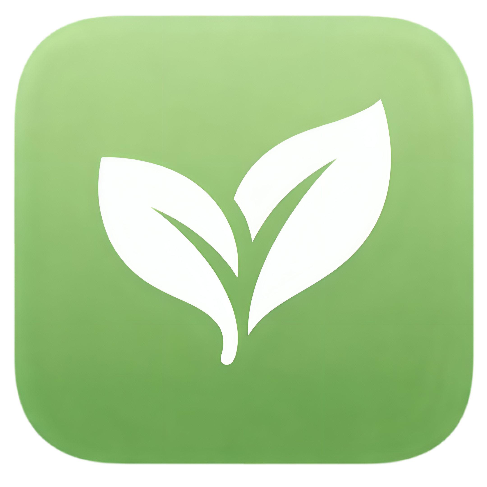

<p align="center">
  
  <br><br>
  
</p>

A recipe app for university students in shared housing who want to eat according to their dietary goals.

## What It Does

Snap a photo of your fridge, select only your ingredients, and get recipes filtered by your diet and time constraints.

## The Problem

University students face daily friction when cooking:

- Open the fridge, see a mess of ingredients (some yours, some not), no idea what to make
- Want recipes that fit your diet but recipe apps don't filter this way
- Have 15 minutes before class and need something fast
- Half the fridge isn't yours, and no app accounts for shared living

## User Flow

```
1. Tap "Scan Your Fridge" (ideally you would take many if visibility is poor from 1 singular picture)
2. Take photo of ingredients
3. AI detects visible items
4. Select only what's yours (tap to include/exclude)
5. Choose your diet (high protein, keto, high calorie, vegetarian, etc.)
6. Set time available (10, 20, 30+ minutes)
7. Get matched recipes with nutrition info
8. View full recipe with step-by-step instructions
```

## Features

**Fridge Photo Scanning**
Take a photo of your fridge, pantry, or counter. OpenAI Vision detects all visible ingredients and returns them with confidence scores.

**Select What's Yours**
Detected ingredients appear as selectable chips. Tap to include only what belongs to you. Manually add items the AI missed.

**Diet Filters**

- High Protein: protein-focused meals
- Keto: low carb, high fat
- High Calorie: for bulking or weight gain
- Low Calorie: for cutting or weight loss
- Balanced: no specific restrictions
- Fun/Comfort: when you just want something good

**Dietary Requirements**
Vegetarian, vegan, gluten-free, dairy-free, halal

**Time Filters**
10 minutes, 20 minutes, 30+ minutes

**Equipment Constraints**
Microwave only, no oven, one pot, beginner friendly

**Recipe Results**
Sorted by ingredient match, protein content, or cook time. Shows what you have vs what you'd need to buy.

## Tech Stack

| Layer | Technology |
|-------|------------|
| Frontend | React Native + Expo |
| Backend | Express.js |
| AI | OpenAI Vision API |
| Deployment | Vercel |

## Architecture

```
Photo -> Backend -> OpenAI Vision -> Ingredient list
-> User selects ingredients + filters
-> Backend matches recipes, scores by ingredient coverage
-> Sorted results returned to frontend
```

## AI Ingredient Detection

The OpenAI Vision prompt returns structured JSON:

```json
[
  {"name": "chicken breast", "confidence": 0.95, "category": "protein"},
  {"name": "brown rice", "confidence": 0.90, "category": "carbs"},
  {"name": "broccoli", "confidence": 0.85, "category": "vegetables"}
]
```

Categories: protein, carbs, vegetables, fruits, dairy, condiment, spices, other

## What Makes It Different

No other app combines:

1. Photo scanning of fridge contents
2. Ingredient selection for shared living
3. Diet-specific filtering (keto, high protein, high cal, etc.)
4. Time-based filtering
5. Student-focused simplicity

The combination is the product.

## Target User

University students who live in shared accommodation and want to cook meals that fit their specific dietary goals without the friction.
